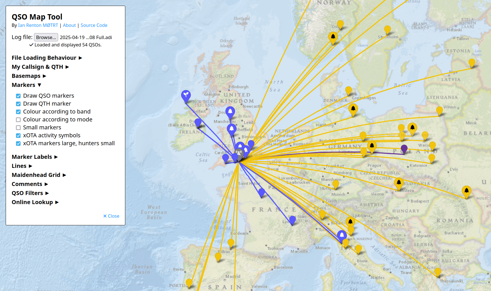

# 9M2PJU QSO Map Tool

**A modern, high-performance utility for amateur radio operators to visualize their logbook data on an interactive map.**

## 🚀 Overview

The **QSO Map Tool** is a purely client-side web application designed to help Hams visualize their contacts. Whether you are analyzing your contest performance, checking your propagation reach, or simply admiring your logbook, this tool provides a beautiful and privacy-focused way to do it.

Processing happens entirely in your browser. **No log data is uploaded to any server.**

## ✨ Key Features

### 🎨 Visuals & UI
*   **Light Tech Theme**: A sleek, modern aesthetic featuring a clean light background, **Tech Blue** accents, and **Glassmorphism** panels.
*   **Fully Responsive**: Optimized for desktops, tablets, and mobile phones.
*   **High Performance**: Handles large log files smoothly using advanced rendering techniques.

### 🗺️ Mapping & Data
*   **Multi-Format Support**: Load `.adi` (ADIF), `.cbr` (Cabrillo), and `.csv` (SOTA/Generic) files.
*   **Rich Layers**:
    *   **Geodesic Lines**: Visualize the Great Circle path to each contact.
    *   **Maidenhead Grids**: Overlay 4-character and 6-character grid squares.
    *   **Zones**: Display [CQ Zones](https://en.wikipedia.org/wiki/CQ_Zone) and [ITU Zones](https://en.wikipedia.org/wiki/ITU_Zone).
    *   **Heatmaps**: Generate global or per-band heatmaps to see activity hotspots.
    *   **WAB/WAI**: Specialized grids for Worked All Britain/Ireland.

### 🔒 Privacy First
*   **Zero Data Collection**: Your log files stay on your device.
*   **No Tracking**: No analytics, no cookies, no ads.

## 🛠️ Getting Started

1.  **Open the Tool**: Visit the hosted page (or your local instance).
2.  **Load Data**: Click the **Data** button and select your log file.
    *   *Tip: You can append multiple files to merge logs.*
3.  **Customize View**: Use the **Display** menu to:
    *   Change the base map layer.
    *   Toggle lines, markers, and labels.
    *   Enable specific overlays (Grids, Zones).
4.  **Analyze**: Open the **Stats** menu to view detailed breakdown of your contacts by band, mode, and distance.

## 💻 Technical Details

The project is built with standard web technologies, ensuring long-term compatibility and ease of hosting.

*   **Core**: HTML5, CSS3 (Custom Properties), Vanilla JavaScript (ES6).
*   **Mapping Engine**: [Leaflet.js](https://leafletjs.com/) with plugins for heatmaps, geodesic lines, and grids.
*   **Styling**: Custom CSS with Glassmorphism effects and responsive Flexbox/Grid layouts.
*   **Fonts**: *Orbitron* (Headers) and *Rajdhani* (Body) from Google Fonts.

## 🤝 Credits & Acknowledgements

*   **Original Author**: [Ian Renton, MØTRT](https://ianrenton.com).
*   **DXCC Data**: [k0swe/dxcc-json](https://github.com/k0swe/dxcc-json/).
*   **Map Layers**: Thanks to HA8TKS for the Maidenhead and Zone logic.

## 📜 License

This project is dedicated to the **Public Domain**. You are free to use, modify, distribute, and perform the work, even for commercial purposes, without asking permission.
